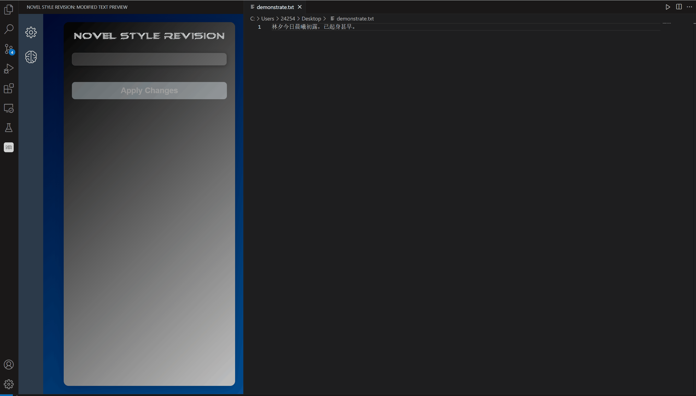
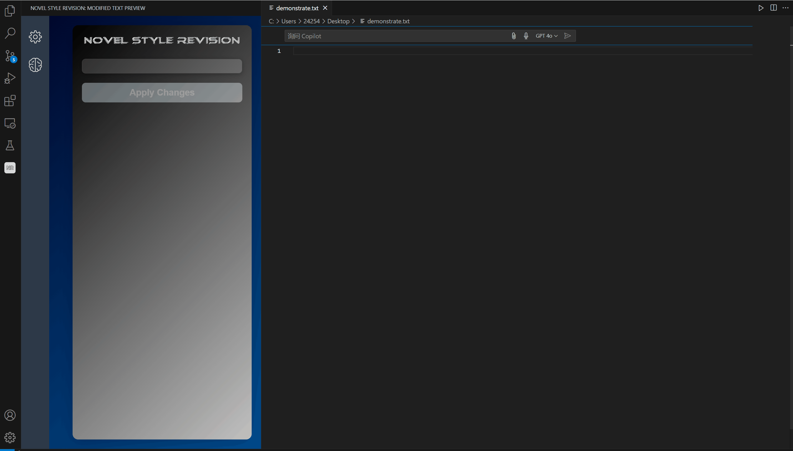
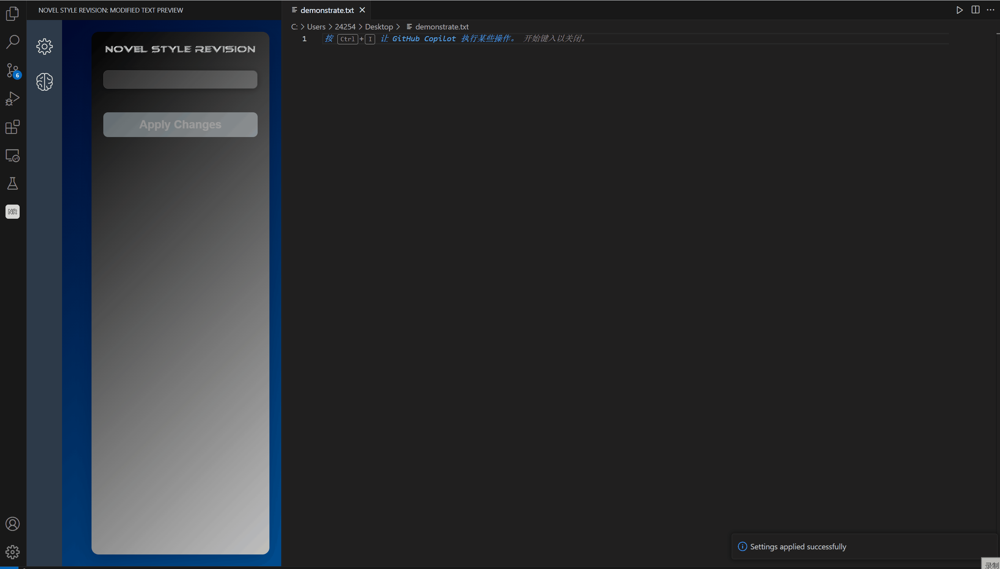

# novel-style-revision README
This is the README for extension "novel-style-revision".  
  
这是插件"novel-style-revision"的README文件。  
  
これはプラグイン「novel-style-revision」のREADMEファイルです。

## Features

**novel-style-revision** is a VSCode plugin designed to enhance your writing style in real time. With its unique dual-cursor feature, you can write seamlessly: the end cursor follows your input while the starting cursor remains fixed. Once you stop typing, the plugin automatically sends the selected text to an intelligent language model (LLM), which refines the style and language, and displays the revised text. Effortlessly improve your writing quality, making your expression smoother and more precise. Writing has never been more efficient and enjoyable!  
  
**novel-style-revision** 是一款专为提升写作风格而设计的 VSCode 插件，能够实时优化您的写作效果。插件独特的“双光标”功能让您书写更加流畅：结束光标跟随您的输入，而起始光标保持固定。一旦您停止输入，插件会自动将选中的文本发送到智能语言模型 (LLM)，对文本进行风格和语言的优化，并展示修订后的内容。轻松提升写作质量，使表达更加流畅精准，让写作变得前所未有的高效与愉悦！  
  
**novel-style-revision** は、執筆スタイルの向上を目的とした VSCode 拡張機能で、リアルタイムで執筆効果を最適化します。プラグインのユニークな「ダブルキャレット」機能により、スムーズに書き進めることができます。終了キャレットは入力に従い、開始キャレットは固定されます。入力を停止すると、選択したテキストが自動的にインテリジェントな言語モデル (LLM) に送信され、テキストのスタイルと言語が最適化され、修正された内容が表示されます。執筆の質を簡単に向上させ、表現をより流暢で正確にし、執筆をこれまでにないほど効率的で楽しいものにします！

## Feature demonstration tutorial

In the followingThink(default) mode, the input text requiring a style change will be automatically highlighted. After 3 seconds of no input, the LLM will provide synonymous text in the target style, as configured in your settings, in the left sidebar. You can apply the suggested changes using the Tab shortcut key or by clicking the "Apply Changes" button in the sidebar.  
  
在 **followingThink（默认）模式** 下，需要调整风格的输入文本会自动高亮显示。若 3 秒内没有输入，**LLM** 会根据您在设置中配置的目标风格，在左侧边栏提供同义的优化文本建议。您可以通过快捷键 **Tab** 或点击边栏中的 **“应用思考”** 按钮来应用建议的修改。  
  
**followingThink（デフォルト）モード** では、スタイルを調整する入力テキストが自動的にハイライト表示されます。3秒以内に入力がない場合、**LLM** は設定で指定した目標スタイルに基づいて、左側のサイドバーに同義の最適化されたテキスト提案を表示します。提案された修正を適用するには、ショートカットキー **Tab** を使うか、サイドバーの **「思考を適用」** ボタンをクリックしてください。  


  
If you prefer the LLM not to continuously provide suggestions and only generate alternative styles when needed, you can disable the "Enable Auto-Think" option in the settings and click the "Apply Settings" button. In this mode, you can manually trigger a suggestion by using the **Ctrl + Tab** shortcut.  
  
如果您希望 LLM 不持续提供建议，而仅在需要时生成替代风格的文本，可以在设置中禁用 **“启用自动思考”** 选项，并点击 **应用设置** 按钮。在此模式下，您可以通过快捷键 **Ctrl + Tab** 手动触发建议生成。  
  
LLM が継続的に提案を提供せず、必要なときにのみ代替スタイルのテキストを生成することを希望する場合は、設定で **「自動思考を有効にする」** オプションを無効にし、**設定を適用** ボタンをクリックしてください。このモードでは、ショートカットキー **Ctrl + Tab** を使用して手動で提案生成をトリガーできます。  
  

  
If you're not satisfied with the selected area, you can use the **Ctrl + '** shortcut to enter Selection Edit Mode. In this mode, you can adjust the boundaries of the selection using the **← → ↑ ↓** arrow keys. By default, the right boundary is controlled, but you can switch the boundary you want to adjust by pressing the **Space** key. To exit Selection Edit Mode, simply press the **Ctrl + '** shortcut again.  
  
如果您对选定区域不满意，可以使用快捷键 **Ctrl + '** 进入 **选择区编辑模式**。在此模式下，您可以使用 **← → ↑ ↓** 方向键调整选区的边界。默认情况下，调节的是选区的右边界，但您可以通过按下 **空格键** 切换要调整的边界。此外要退出选择编辑模式，只需再次按下快捷键 **Ctrl + '**。  
  
選択した領域に満足できない場合は、ショートカットキー **Ctrl + '** を使って **選択領域編集モード** に入ることができます。このモードでは、**← → ↑ ↓** の矢印キーを使って選択範囲の境界を調整できます。デフォルトでは、調整するのは選択範囲の右境界ですが、**スペースキー** を押すことで調整する境界を切り替えることができます。さらに、選択編集モードを終了するには、もう一度ショートカットキー **Ctrl + '** を押すだけです。  
  

  
If you want to quickly clear the current selection, you can use the **ESC** shortcut. This will reposition both the left and right boundaries of the selection to your cursor's current location.  
  
如果您想快速清除当前选区，可以使用快捷键 **ESC**。此操作会将选区的左右边界重置到光标的当前位置。  
  
現在の選択範囲を迅速にクリアしたい場合は、ショートカットキー **ESC** を使用してください。この操作により、選択範囲の左右境界がカーソルの現在位置にリセットされます。  


  
Additionally, you can customize the selection color in the settings, as well as adjust the activation interval for LLM thinking in FollowThinking mode.  
  
此外，您还可以在设置中自定义选区的颜色，并通过调整 **自动思考间隔** 的值调节 LLM 思考的激活间隔时间。  
  
さらに、設定で選択範囲の色をカスタマイズしたり、**自動思考間隔** の値を調整して LLM の思考を発動する間隔時間を変更することもできます。

## Requirements & Installation

This extension uses the following dependencies:
* **axios**
    * A promise-based HTTP client for making requests to an API.
    * Recommend Version 1.7.7

## Installation

To install this extension, ensure you have all necessary dependencies listed in the `package.json` file. You can install the required dependencies by running:

```bash
npm install
```

## Extension Settings

This extension contributes the following settings:

* "novel-style-revision.style": Set your target writing style. Default : "村上春树".
* "novel-style-revision.language": Set your writing language. Default: "简体中文".
* "novel-style-revision.selectColor": Set the color of the background of the selected text. Default: "rgba(255, 0, 0, 0.3)".
* "novel-style-revision.followingThink": Open the following think. if true, LLM will auto think after several seconds you stop typing. Default: true.
* "novel-style-revision.followingThinkInterval": Only valid when followingThink is True. And it means the milliseconds of the interval of auto thinking. Default: 3000.
* "novel-style-revision.baseURL": Set the base URL of your LLM API. Default: "https://open.bigmodel.cn/api/paas/v4/chat/completions".
* "novel-style-revision.apiKey": Set the API key of your LLM API.

## Release Notes

### 1.0.0
* Initial release of novel-style-revision

### 1.0.1
* Optimize the GUI of the plugin.
* Support multi-document autocomplete state caching.

### 1.0.2
* Fix the bug that the extension will be crashed when you active extension before you open text file.
* Optimized the Tab key shortcut logic to ensure compatibility with Copilot's suggestion functionality.
* Added a tutorial video for feature demonstration in the README file.

### 1.0.3  
* Optimized the plugin's language support logic to display the corresponding language UI within the plugin based on the default language in your VSCode (currently supporting Simplified Chinese, Japanese, and English UI).
