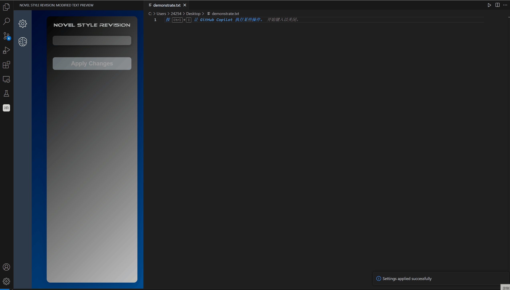

# novel-style-revision README

这是插件"novel-style-revision"的中文版README文件

## 插件特点

**novel-style-revision** 是一款专为提升写作风格而设计的 VSCode 插件，能够实时优化您的写作效果。插件独特的“双光标”功能让您书写更加流畅：结束光标跟随您的输入，而起始光标保持固定。一旦您停止输入，插件会自动将选中的文本发送到智能语言模型 (LLM)，对文本进行风格和语言的优化，并展示修订后的内容。轻松提升写作质量，使表达更加流畅精准，让写作变得前所未有的高效与愉悦！

## 插件使用演示

在 **followingThink（默认）模式** 下，需要调整风格的输入文本会自动高亮显示。若 3 秒内没有输入，**LLM** 会根据您在设置中配置的目标风格，在左侧边栏提供同义的优化文本建议。您可以通过快捷键 **Tab** 或点击边栏中的 **“应用思考”** 按钮来应用建议的修改。

如果您希望 LLM 不持续提供建议，而仅在需要时生成替代风格的文本，可以在设置中禁用 **“启用自动思考”** 选项，并点击 **应用设置** 按钮。在此模式下，您可以通过快捷键 **Ctrl + Tab** 手动触发建议生成。

如果您对选定区域不满意，可以使用快捷键 **Ctrl + '** 进入 **选择区编辑模式**。在此模式下，您可以使用 **← → ↑ ↓** 方向键调整选区的边界。默认情况下，调节的是选区的右边界，但您可以通过按下 **空格键** 切换要调整的边界。此外要退出选择编辑模式，只需再次按下快捷键 **Ctrl + '**。

如果您想快速清除当前选区，可以使用快捷键 **ESC**。此操作会将选区的左右边界重置到光标的当前位置。

此外，您还可以在设置中自定义选区的颜色，并通过调整 **自动思考间隔** 的值调节 LLM 思考的激活间隔时间。

## 依赖

本插件主要的依赖项如下:
* **axios**
    * 一个基于 Promise 的 HTTP 请求库，用于向 LLM API 发起请求。
    * 推荐版本 1.7.7

## 安装

要安装此扩展，请确保您已安装 `package.json` 文件中列出的所有必要依赖项。您可以通过运行以下命令来安装所需的依赖项：

```bash
npm install
```

## 插件设置

本插件的主要设置项如下:

* "novel-style-revision.style": 设置您的目标风格。默认 : "村上春树"。
* "novel-style-revision.language": 设置您的写作语言。 默认: "简体中文"。
* "novel-style-revision.selectColor": 设置您选区的高亮颜色。 默认: "rgba(255, 0, 0, 0.3)"。
* "novel-style-revision.followingThink": 自动跟随思考选，启用时LLM会自动在您停止输入的数秒后进行思考。默认: true。
* "novel-style-revision.followingThinkInterval": 当且仅当自动跟随思考选项启用时有效，其为从停止输入到LLM开始思考的间隔时间（以毫秒为单位）。默认: 3000。
* "novel-style-revision.baseURL": 设置您的LLM baseURL。默认: "https://open.bigmodel.cn/api/paas/v4/chat/completions"。
* "novel-style-revision.apiKey": 设置您与baseURL对应的apiKey。

## 版本发布记录

### 1.0.0
* novel-style-revision 初始版。

### 1.0.1
* 优化了插件的图形化界面
* 支持多文件选取状态缓存

### 1.0.2
* 修复了在打开文本文件之前激活插件会导致插件崩溃的bug。
* 优化了**Tab**快捷键的处理逻辑，兼容**copilot**的联想。
* 在README文件中增设演示视频。

### 1.0.3
* 优化了插件的语言支持逻辑，根据您vscode中的默认语言，显示对应语言的插件内UI（目前仅支持简体中文，日文，英文UI界面）。